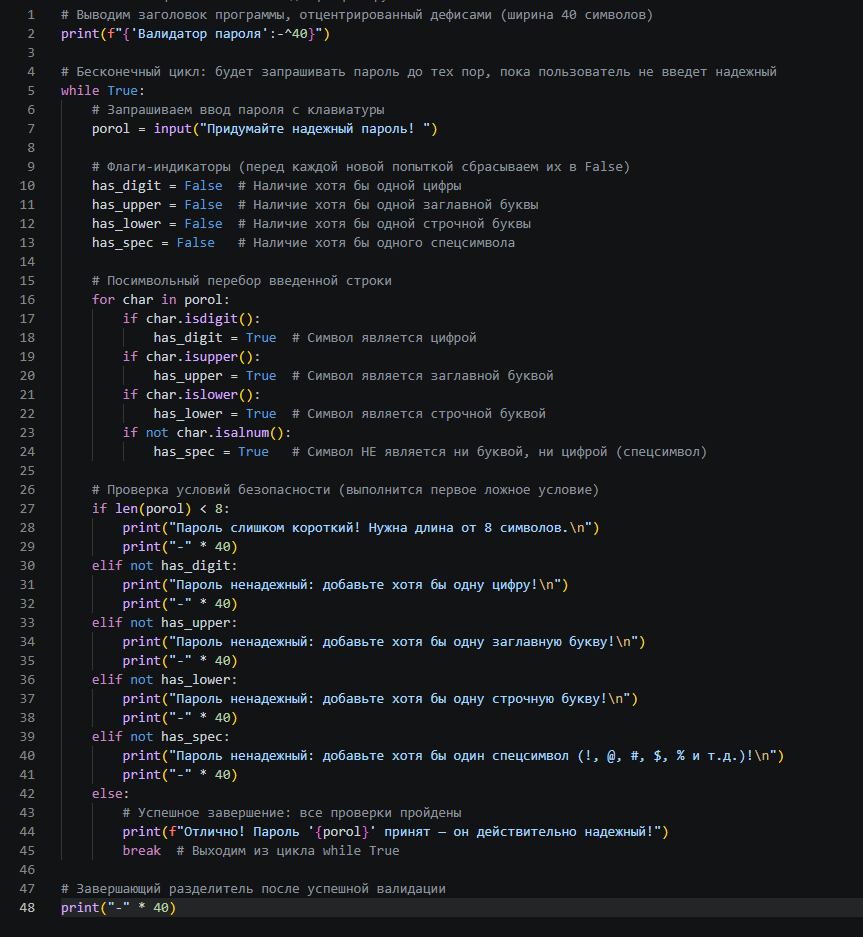

# Password Validator / Валидатор паролей на Python

Простая консольная утилита на Python для проверки сложности и надежности пользовательского пароля[cite: 13].

## 📌 Функционал

Программа запрашивает ввод пароля и проверяет его по следующим критериям[cite: 13]:
1. **Длина:** не менее 8 символов[cite: 13].
2. **Цифры:** наличие хотя бы одной цифры (`0-9`)[cite: 13].
3. **Регистр букв:** наличие заглавных (`A-Z`) и строчных (`a-z`) букв[cite: 13].
4. **Спецсимволы:** наличие хотя бы одного не-буквенно-цифрового символа (знаки пунктуации, спецсимволы)[cite: 13].

Если пароль не соответствует хотя бы одному из правил, программа выводит конкретное сообщение об ошибке и просит повторить ввод[cite: 13].

## 🛠 Технические особенности

* **Перебор символов:** проверку состава пароля выполняет цикл `for char in porol:` с использованием встроенных строковых методов Python[cite: 13]:
  * `.isdigit()` — проверка на цифру[cite: 13]
  * `.isupper()` — проверка на заглавную букву[cite: 13]
  * `.islower()` — проверка на строчную букву[cite: 13]
  * `not .isalnum()` — проверка на спецсимвол[cite: 13]
* **Управление потоком:** обработка повторных попыток реализована через цикл `while True` с выходом по оператору `break` при успехе[cite: 13].

## 📸 Скриншот работы


## 💻 Пример работы

```text
----------------Валидатор пароля----------------
Придумайте надежный пароль! 123
Пароль слишком короткий! Нужна длина от 8 символов.
----------------------------------------

Придумайте надежный пароль! 123435678
Пароль ненадежный: добавьте хотя бы одну заглавную букву!
----------------------------------------

Придумайте надежный пароль! 12342567A
Пароль ненадежный: добавьте хотя бы одну строчную букву!
----------------------------------------

Придумайте надежный пароль! 12314525Aa44
Пароль ненадежный: добавьте хотя бы один спецсимвол (!, @, #, $, % и т.д.)!
----------------------------------------

Придумайте надежный пароль! 241414WRf%#
Отлично! Пароль '241414WRf%#' принят — он действительно надежный!
----------------------------------------
